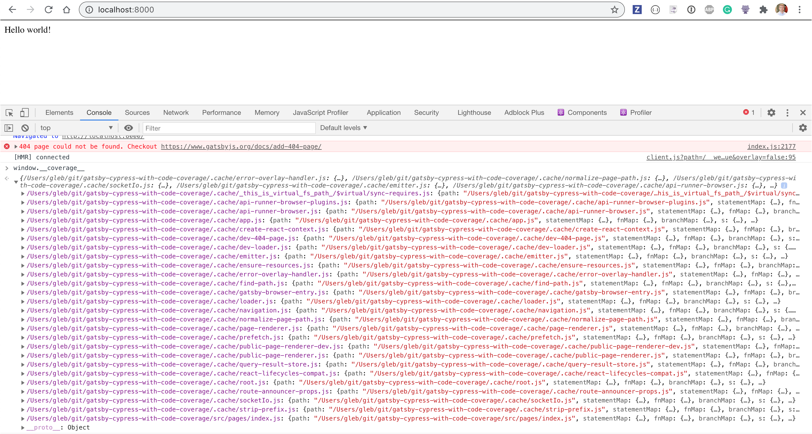
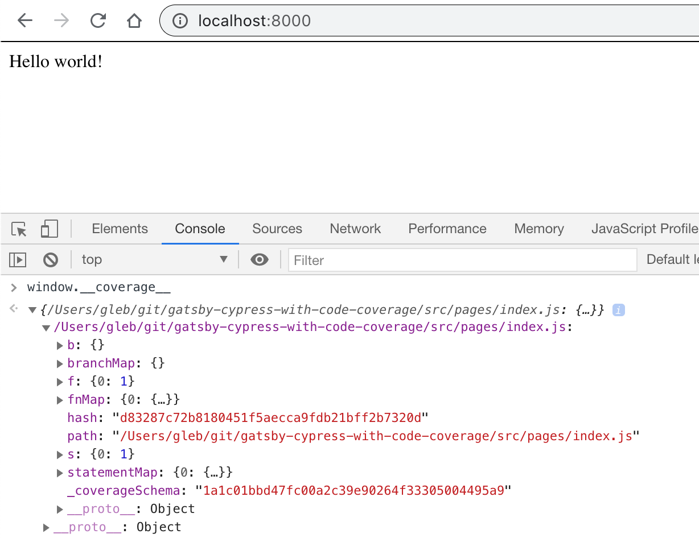
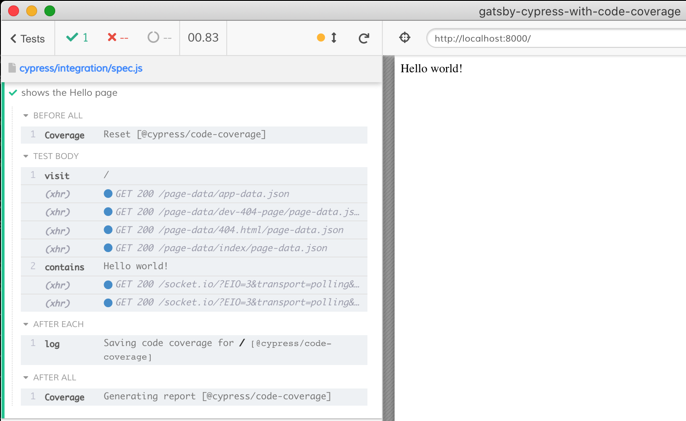
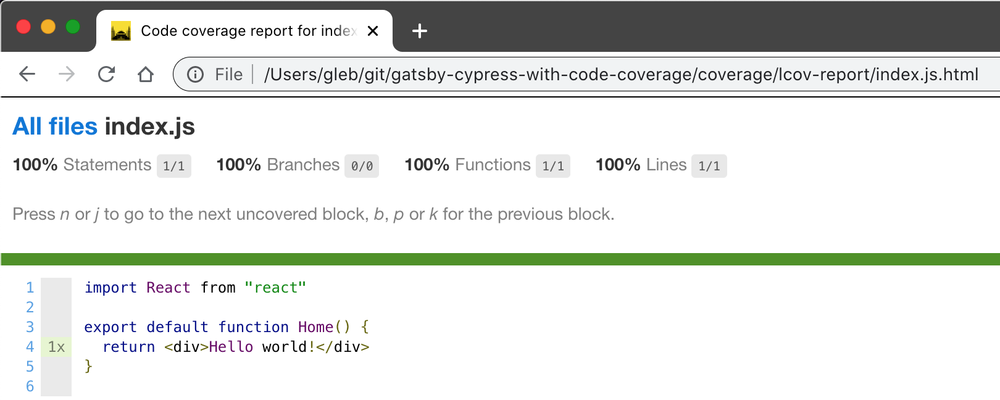

# gatsby-cypress-with-code-coverage

> Gatsby example site with Cypress E2E tests and code coverage

This repository was scaffolded from the official [starter example](https://github.com/gatsbyjs/gatsby-starter-hello-world). Then I have added [babel-plugin-istanbul]() following the [Gatsby Babel documentation](https://github.com/gatsbyjs/gatsby-starter-hello-world)

```
npm i -D babel-preset-gatsby babel-plugin-istanbul
+ babel-preset-gatsby@0.8.0
+ babel-plugin-istanbul@6.0.0
```

The [.babelrc](.babelrc) imports the plugins

```json
{
  "plugins": [
    [
      "babel-plugin-istanbul"
    ]
  ],
  "presets": [
    [
      "babel-preset-gatsby",
      {
        "targets": {
          "browsers": [
            ">0.25%",
            "not dead"
          ]
        }
      }
    ]
  ]
}
```

Immediately you can see the `window.__coverage__` object in the DevTools console



We do not want `.cache` files in the coverage list, we only want our local `src` files instrumented. We can modify the plugin's settings in `.babelrc` to include only files in the `src` folder.

```json
{
  "plugins": [
    [
      "babel-plugin-istanbul", {
        "include": ["src/**/*.js"]
      }
    ]
  ]
}
```

The `window.__coverage__` object now has a single entry.



We do not want to instrument the source code in production. Thus let's move the Istanbul plugin into `develop` environment

```json
{
  "env": {
    "develop": {
      "plugins": [
        [
          "babel-plugin-istanbul",
          {
            "include": [
              "src/**/*.js"
            ]
          }
        ]
      ]
    }
  }
}
```

If you run `npm run develop`, the `window.__coverage__` object will not be defined. If you execute `NODE_ENV=develop npm run develop` the code will be instrumented.

Let's add [Cypress](https://github.com/cypress-io/cypress) and its [code coverage plugin](https://github.com/cypress-io/code-coverage)

```
$ npm i -D cypress @cypress/code-coverage
+ cypress@6.0.1
+ @cypress/code-coverage@3.8.5
```

We can quickly scaffold a spec file to simply load the page and assert the "Hello" is there.

```
$ npx @bahmutov/cly init
```

Let's use [start-server-and-test]() to start Gatsby and open Cypress

```
$ npm i -D start-server-and-test
+ start-server-and-test@1.11.6
```

In `package.json` define the scripts

```json
{
  "scripts": {
    "develop": "gatsby develop",
    "cy:open": "cypress open",
    "dev": "NODE_ENV=develop start-test develop 8000 cy:open"
  }
}
```

Follow the instructions in the code coverage plugin to add it to the plugins and support files. Then use the command `npm run dev` to open Cypress. Run the test

```js
// cypress/integration/spec.js
it("shows the Hello page", () => {
  cy.visit("/").contains("Hello world!")
})
```

Notice the code coverage log messages



Open the coverage HTML report (there are reports in different formats sorted in the folder `coverage)

```
$ open coverage/lcov-report/index.html
```

Inspect the report


